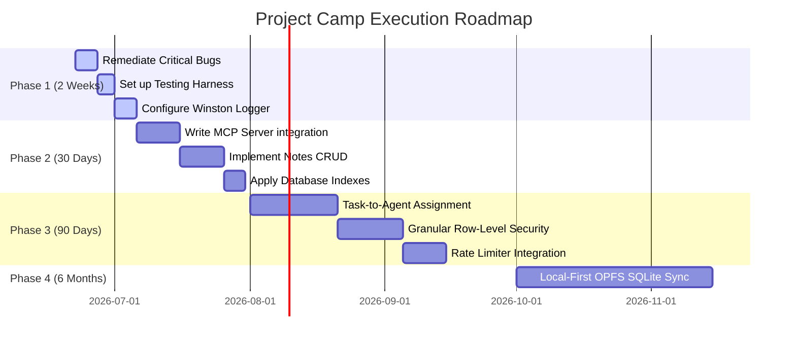

# Roadmap & Engineering Execution Plan: Project Camp

This document translates technical audit findings and market opportunity insights into a concrete product roadmap, skill acquisition path, and prioritized engineering TODO list.

---

## 1. Gap Analysis

We compare the current state of Project Camp with market demands, competitors (Linear, Jira, ClickUp), and macro engineering trends (Local-First, MCP).

1. **Plaintext Credential Leakage in Logs:** The logger in [app.js](file:///Users/rohan/project-base/src/app.js#L15-L21) outputs raw request bodies (including registration/login passwords) to stdout.

### High-Leverage Gaps (Competitive Advantage)
1. **Missing Model Context Protocol (MCP) Server:** Coding agents (Claude, Cursor, Devin) cannot natively query project tasks or read notes to fetch context or document their progress.
2. **Missing Local-First Data Sync Layer:** The API relies on classic, high-latency HTTP requests rather than serving state instantly from client-side relational replicas (Origin Private File System + CRDTs).
3. **No Testing Infrastructure:** There are zero unit or integration tests, meaning any code modifications are highly likely to break existing (and undocumented) API contracts.

### Nice-to-Have Gaps (Future Refinement)
1. **Unimplemented Notes Module:** Notes routes are commented out, and controllers are empty stubs.
2. **No Rate Limiter:** The API is vulnerable to brute-force auth requests and resource exhaustion.
3. **Unimplemented Task File Attachments:** Scaffolding exists, but `multer` is not installed, and uploads are not wired to S3 or cloud storage.

---

## 2. Prioritization Matrix

We score opportunities using a weighted formula:
$$\text{Weighted Score} = \frac{(\text{User Impact} \times 0.2) + (\text{Revenue} \times 0.2) + (\text{Strategic Value} \times 0.2) + (\text{Timing} \times 0.2) + (\text{Defensibility} \times 0.2)}{(\text{Difficulty} \times 0.5) + (\text{Engineering Effort} \times 0.5)}$$

*Scores are on a 1-10 scale (where lower Difficulty/Effort is better/easier).*

| Opportunity / Feature | User Impact | Revenue | Strategic Value | Market Timing | Defensibility | Difficulty (Inv) | Effort (Inv) | Weighted Score |
| :--- | :---: | :---: | :---: | :---: | :---: | :---: | :---: | :---: |
| **1. Fix Critical Bugs (Server run)** | 10 | 10 | 10 | 10 | 10 | 1 (Easy) | 1 (Low) | **10.00** |
| **2. Native MCP Server Interface** | 9 | 8 | 10 | 10 | 9 | 4 (Med) | 3 (Low) | **2.63** |
| **3. Testing & CI/CD Framework** | 7 | 5 | 8 | 6 | 5 | 3 (Easy) | 4 (Med) | **1.77** |
| **4. Structured Logger & Rate Limiter**| 6 | 4 | 7 | 6 | 4 | 2 (Easy) | 2 (Low) | **2.70** |
| **5. Notes CRUD Implementation** | 6 | 4 | 6 | 5 | 3 | 3 (Easy) | 3 (Low) | **1.60** |
| **6. Task-to-Agent Assignment System**| 8 | 9 | 10 | 9 | 8 | 6 (Hard) | 6 (Hard) | **1.47** |
| **7. Local-First OPFS Sync Engine** | 9 | 7 | 9 | 9 | 10 | 8 (Hard) | 8 (Hard) | **1.10** |
| **8. Multi-Tenant Row-Level Security**| 8 | 8 | 8 | 7 | 7 | 5 (Med) | 5 (Med) | **1.52** |
| **9. Database Index Optimization** | 7 | 4 | 7 | 5 | 4 | 2 (Easy) | 2 (Low) | **2.70** |
| **10. Cloud Task File Attachments** | 5 | 5 | 4 | 4 | 3 | 4 (Med) | 4 (Med) | **1.05** |

---

## 3. Build Recommendations (Top 10 Ranked)

### 1. Fix Critical Bugs & Security Leaks
- **Problem Solved:** Server crash, broken project routes, and plain-text credential leaks in stdout.
- **Expected Impact:** High. Enables a running, secure developer environment.
- **Engineering Effort:** Extremely Low.
- **Risks / Dependencies:** None.

### 2. Implement Native MCP (Model Context Protocol) Server
- **Problem Solved:** AI agents cannot query, write, or update task and note contexts.
- **Expected Impact:** Extremely High. Positions Project Camp as the default PM context registry for developers using AI coding tools.
- **Engineering Effort:** Low-Medium (Uses `@modelcontextprotocol/sdk`).
- **Risks / Dependencies:** Requires API key authorization for agents.

### 3. Establish Structured Logging & Security Auditing
- **Problem Solved:** Unstructured logs, plaintext credential leakage, and lack of audit trails for project document modifications.
- **Expected Impact:** High. Necessary for SOC2 compliance and production security.
- **Engineering Effort:** Low. Replace console logs with Winston or Pino.
- **Risks / Dependencies:** Dependency on environment-scoped configurations.

### 4. Create Testing & CI/CD Pipelines
- **Problem Solved:** Silent code regressions; high manual verification overhead.
- **Expected Impact:** Medium-High. Drastically reduces developer friction.
- **Engineering Effort:** Medium. Wire up Jest, Supertest, and GitHub Actions.
- **Risks / Dependencies:** Requires database mock utilities (MongoDB Memory Server).

### 5. Implement Notes Module CRUD
- **Problem Solved:** No project-level documentation workspace; notes routes are stubbed out.
- **Expected Impact:** Medium. Standard PM utility.
- **Engineering Effort:** Low-Medium.
- **Risks / Dependencies:** Requires Zod validation schema implementation.

### 6. Introduce Database Query Indexing & Optimization
- **Problem Solved:** Latency spikes during project listing and task aggregation.
- **Expected Impact:** Medium. Essential before adding volume.
- **Engineering Effort:** Low. Apply compound indexes to MongoDB collections.
- **Risks / Dependencies:** Requires index verification.

### 7. Task-to-Agent Assignment System
- **Problem Solved:** Humans cannot assign tasks to AI agents; agents cannot report outcomes directly.
- **Expected Impact:** High. Delivers the core hybrid team value proposition.
- **Engineering Effort:** High. Requires background task queues (e.g. BullMQ) and LLM connectors.
- **Risks / Dependencies:** Agent failure/looping risks; requires API keys for OpenAI/Anthropic.

### 8. Add Multi-Tenant Row-Level Security (RLS)
- **Problem Solved:** Basic RBAC check is not granular enough; users can accidentally fetch items across tenants.
- **Expected Impact:** High. Ensures absolute data isolation.
- **Engineering Effort:** Medium. Update query engines to enforce `{ project: projectId }` filters at database driver levels.
- **Risks / Dependencies:** None.

### 9. Build Local-First OPFS Sync Engine (Zero Sync / PGLite)
- **Problem Solved:** High latency web requests; poor offline editing capability.
- **Expected Impact:** Very High. Delivers sub-10ms latency.
- **Engineering Effort:** Very High. Requires client-side SQLite integration and a sync-gateway cache.
- **Risks / Dependencies:** Massive front-end refactoring; requires migration to SQLite.

### 10. Task File Attachments (Cloud-native S3)
- **Problem Solved:** Uploading file artifacts associated with project issues.
- **Expected Impact:** Medium.
- **Engineering Effort:** Medium. Integrate AWS S3 SDK (avoid local disk Multer storage).
- **Risks / Dependencies:** Cloud cost controls; file validation safety.

---

## 4. Execution Roadmap

### Next 2 Weeks (Remediation & Stability)
* **Goal:** Zero compile errors, secure credentials, and stable route parameters.
* **Tasks:**
  - Fix Zod `z.email()` syntax issue.
  - Correct `checkProjectPermission` parameter mappings (remove from root `GET /` project route, map to invite params).
  - Clean out plaintext credential logs from debug middleware.
  - Install Jest and Supertest; write auth integration tests.

### Next 30 Days (AI Context Capability)
* **Goal:** Enable Model Context Protocol (MCP) and implement basic notes.
* **Tasks:**
  - Create Zod schemas for Notes CRUD.
  - Implement note controllers and mount note routes.
  - Build MCP endpoints (`/mcp`) enabling AI clients to read project tasks/notes.
  - Add compound indexes to Task and ProjectMember collections.

### Next 90 Days (Hybrid Orchestration & Security)
* **Goal:** Launch agent-to-task execution engine and secure multi-tenant boundaries.
* **Tasks:**
  - Add "Agent" attributes to User schema.
  - Integrate BullMQ/Redis task queues for background agent execution.
  - Implement rate limiting on API routers.
  - Secure queries with strict Row-Level Security schemas.

### Next 6 Months (Performance Frontier)
* **Goal:** Move to a fully local-first synchronization workspace.
* **Tasks:**
  - Migrate client state machine to client-side SQLite WASM.
  - Establish logical replication stream syncing client SQLite to Postgres/MongoDB.

---

## 5. Skill Gap Analysis

To successfully execute this roadmap, the following skills must be acquired:

### Learn Immediately (Next 2 Weeks)
1. **Zod Schema Primitives & Transformations**
   - *Why it matters:* Prevents critical schema compile crashes and ensures inputs match constraints.
   - *Difficulty:* Low.
   - *Time:* 3 Hours.
   - *Resources:* [Zod Official Documentation](https://zod.dev).
2. **Supertest & Jest API Mocking**
   - *Why it matters:* Crucial to building regression tests without hitting the real production database.
   - *Difficulty:* Medium.
   - *Time:* 12 Hours.
   - *Resources:* Jest guides & Testing MongoDB with Memory Server tutorials.

### Learn Soon (Next 30 Days)
1. **Model Context Protocol (MCP) SDK**
   - *Why it matters:* Essential for making project data discoverable to AI agents like Claude.
   - *Difficulty:* Medium.
   - *Time:* 10 Hours.
   - *Resources:* [Anthropic MCP Docs](https://modelcontextprotocol.io).
2. **MongoDB Index Optimization & Profiling**
   - *Why it matters:* Critical to prevent API latency degradation under query load.
   - *Difficulty:* Medium.
   - *Time:* 8 Hours.
   - *Resources:* MongoDB University (Indexing course).

### Learn Later (Next 90 Days+)
1. **Conflict-Free Replicated Data Types (CRDTs)**
   - *Why it matters:* Required to implement latency-free, offline collaboration without data loss.
   - *Difficulty:* High.
   - *Time:* 40 Hours.
   - *Resources:* Loro.dev guides, Fugue algorithm research papers.

---

## 6. Engineering TODOs

### Critical (Blockers)
- [ ] Fix `z.email()` to `z.string().email()` in [response.schemas.js](src/validators/response.schemas.js#L16).
- [ ] Remove `checkProjectPermission` middleware from the root Project route (`GET /api/v1/projects/` in [project.routes.js](src/routers/project.routes.js#L52)).
- [ ] Refactor invitation `/resend` and `/cancel` routes to include `:projectId` in the URL schema, or write a dedicated middleware to resolve project membership via `invitationId`.
- [ ] Strip raw `req.body` logging from the debug middleware in [app.js](src/app.js#L19).

### High Priority (Stability & Context)
- [ ] Set up Winston logger with environment-scoped log levels (disable query parameter body outputs in production).
- [ ] Install `jest`, `supertest`, and `mongodb-memory-server` devDependencies.
- [ ] Write integration test suites verifying Auth login, token rotation, and basic project creation.
- [ ] Move `nodemon` to `devDependencies` in `package.json`.
- [ ] Add Zod validation schemas for `POST /refresh-access-token` and `POST /delete-user`.

### Medium Priority (Core Features)
- [ ] Create Note Zod validation schemas in `validators/index.js`.
- [ ] Implement Note controller operations (`createNote`, `getNotes`, `getNoteById`, `updateNote`, `deleteNote`) in [note.controllers.js](src/controllers/note.controllers.js).
- [ ] Mount Note routes at `/api/v1/notes` in [app.js](src/app.js).
- [ ] Add compound database indexes on Task model (`project`, `status`) and ProjectMember model (`project`, `user`).

### Low Priority (Optimizations)
- [ ] Install `express-rate-limit` and mount rate limiters on public Auth routes.
- [ ] Clean up all commented-out stubs for File Attachments and bulk operations to reduce technical debt.
- [ ] Align patch routes with documented HTTP methods (update documented PUT routes to PATCH, or update code to use PUT).

---

## 7. Founder Verdict

*An honest, capital-allocation-oriented assessment of Project Camp.*

1. **What would you build next?**
   I would immediately fix the bugs to make the codebase stable, then write the **MCP Server interface**. Being the first to market with a project management tool that AI agents can natively interact with will attract early-adopter startups who are building automated workflows.
2. **What would you delay?**
   **Task File Attachments.** Storing files locally on disk is a cloud anti-pattern. Wiring it to S3 takes valuable engineering time. For early traction, teams can just paste Dropbox or Google Drive links directly in task descriptions.
3. **What would you remove?**
   I would **remove the Notes module placeholder code** entirely until the MCP interface is running. Stubs just invite developers to build standard CRUD when they should be focusing on the AI agent integration.
4. **Biggest risk?**
   **Incumbent Refactoring.** If Linear or ClickUp natively releases a robust MCP server connector or agent workflow engine tomorrow, Project Camp's core differentiator evaporates. We must build fast.
5. **Biggest opportunity?**
   **Becoming the unified management board for autonomous agent fleets.** While everyone else builds simple chat wrappers, we can own the state-machine/coordination database where agents and humans collaborate.
6. **Fastest path to traction?**
   Target **AI startup engineering teams** via a Product Hunt launch showcasing "Jira for Humans & Devin/Swe-agents." Exposing a free, public sandbox demonstrating sub-10ms response speeds will build immediate developer interest.
7. **Fastest path to revenue?**
   Charge a premium enterprise tier for **Self-Hosted MCP sync gateways**. Startups want to run local coding agents but are terrified of uploading their proprietary codebase context to external servers. Exposing a secure, local-first gateway fits this exact need.
8. **What would make this 10x better?**
   Transitioning the front-end to a **local-first relational cache**. Instead of web components polling a REST API, the user UI runs against an in-browser SQLite DB, resulting in instant rendering, even when offline.
