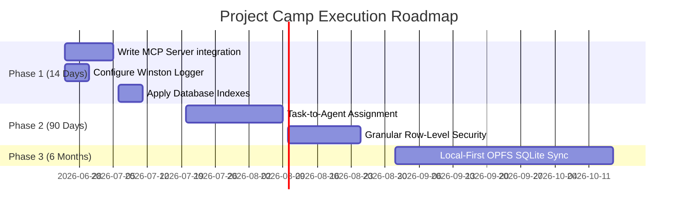

# Roadmap & Engineering Execution Plan: Project Camp

This document translates technical audit findings and market opportunity insights into a concrete product roadmap, skill acquisition path, and prioritized engineering TODO list.

---

## 1. Gap Analysis

We compare the current state of Project Camp with market demands, competitors (Linear, Jira, ClickUp), and macro engineering trends (Local-First, MCP).

### High-Leverage Gaps (Competitive Advantage)

1. **Missing Model Context Protocol (MCP) Server:** Coding agents (Claude, Cursor, Devin) cannot natively query project tasks or read notes to fetch context or document their progress.
2. **Missing Local-First Data Sync Layer:** The API relies on classic, high-latency HTTP requests rather than serving state instantly from client-side relational replicas (Origin Private File System + CRDTs).

### Nice-to-Have Gaps (Future Refinement)

1. **Structured Logging:** Implementing Winston or Pino for robust log output.
2. **Unimplemented Task File Attachments:** Scaffolding exists, but `multer` is not installed, and uploads are not wired to S3 or cloud storage.

---

## 2. Prioritization Matrix

We score opportunities using a weighted formula:
$$\text{Weighted Score} = \frac{(\text{User Impact} \times 0.2) + (\text{Revenue} \times 0.2) + (\text{Strategic Value} \times 0.2) + (\text{Timing} \times 0.2) + (\text{Defensibility} \times 0.2)}{(\text{Difficulty} \times 0.5) + (\text{Engineering Effort} \times 0.5)}$$

_Scores are on a 1-10 scale (where lower Difficulty/Effort is better/easier)._

| Opportunity / Feature                  | User Impact | Revenue | Strategic Value | Market Timing | Defensibility | Difficulty (Inv) | Effort (Inv) | Weighted Score |
| :------------------------------------- | :---------: | :-----: | :-------------: | :-----------: | :-----------: | :--------------: | :----------: | :------------: |
| **1. Native MCP Server Interface**     |      9      |    8    |       10        |      10       |       9       |     4 (Med)      |   3 (Low)    |    **2.63**    |
| **2. Structured Logger**               |      6      |    4    |        7        |       6       |       4       |     2 (Easy)     |   2 (Low)    |    **2.70**    |
| **3. Task-to-Agent Assignment System** |      8      |    9    |       10        |       9       |       8       |     6 (Hard)     |   6 (Hard)   |    **1.47**    |
| **4. Local-First OPFS Sync Engine**    |      9      |    7    |        9        |       9       |      10       |     8 (Hard)     |   8 (Hard)   |    **1.10**    |
| **5. Multi-Tenant Row-Level Security** |      8      |    8    |        8        |       7       |       7       |     5 (Med)      |   5 (Med)    |    **1.52**    |
| **6. Database Index Optimization**     |      7      |    4    |        7        |       5       |       4       |     2 (Easy)     |   2 (Low)    |    **2.70**    |
| **7. Cloud Task File Attachments**     |      5      |    5    |        4        |       4       |       3       |     4 (Med)      |   4 (Med)    |    **1.05**    |

---

## 3. Build Recommendations (Top Ranked)

### 1. Implement Native MCP (Model Context Protocol) Server

- **Problem Solved:** AI agents cannot query, write, or update task and note contexts.
- **Expected Impact:** Extremely High. Positions Project Camp as the default PM context registry for developers using AI coding tools.
- **Engineering Effort:** Low-Medium (Uses `@modelcontextprotocol/sdk`).
- **Risks / Dependencies:** Requires API key authorization for agents.

### 2. Establish Structured Logging & Security Auditing

- **Problem Solved:** Unstructured logs and lack of audit trails for project document modifications.
- **Expected Impact:** High. Necessary for SOC2 compliance and production security.
- **Engineering Effort:** Low. Replace console logs with Winston or Pino.
- **Risks / Dependencies:** Dependency on environment-scoped configurations.

### 3. Introduce Database Query Indexing & Optimization

- **Problem Solved:** Latency spikes during project listing and task aggregation.
- **Expected Impact:** Medium. Essential before adding volume.
- **Engineering Effort:** Low. Apply compound indexes to MongoDB collections.
- **Risks / Dependencies:** Requires index verification.

### 4. Task-to-Agent Assignment System

- **Problem Solved:** Humans cannot assign tasks to AI agents; agents cannot report outcomes directly.
- **Expected Impact:** High. Delivers the core hybrid team value proposition.
- **Engineering Effort:** High. Requires background task queues (e.g. BullMQ) and LLM connectors.
- **Risks / Dependencies:** Agent failure/looping risks; requires API keys for OpenAI/Anthropic.

### 5. Add Multi-Tenant Row-Level Security (RLS)

- **Problem Solved:** Basic RBAC check is not granular enough; users can accidentally fetch items across tenants.
- **Expected Impact:** High. Ensures absolute data isolation.
- **Engineering Effort:** Medium. Update query engines to enforce `{ project: projectId }` filters at database driver levels.
- **Risks / Dependencies:** None.

### 6. Build Local-First OPFS Sync Engine (Zero Sync / PGLite)

- **Problem Solved:** High latency web requests; poor offline editing capability.
- **Expected Impact:** Very High. Delivers sub-10ms latency.
- **Engineering Effort:** Very High. Requires client-side SQLite integration and a sync-gateway cache.
- **Risks / Dependencies:** Massive front-end refactoring; requires migration to SQLite.

### 7. Task File Attachments (Cloud-native S3)

- **Problem Solved:** Uploading file artifacts associated with project issues.
- **Expected Impact:** Medium.
- **Engineering Effort:** Medium. Integrate AWS S3 SDK (avoid local disk Multer storage).
- **Risks / Dependencies:** Cloud cost controls; file validation safety.

---

## 4. Execution Roadmap

### Next 14 Days (AI Context & Foundational Hardening)

- **Goal:** Enable Model Context Protocol (MCP), structure observability, and fortify indexes.
- **Tasks:**
  - Build MCP endpoints (`/mcp`) enabling AI clients to read project tasks/notes.
  - Apply standard Pino/Winston logging configurations.
  - Add compound indexes to Task and ProjectMember collections.

### Next 90 Days (Hybrid Orchestration & Security)

- **Goal:** Launch agent-to-task execution engine and secure multi-tenant boundaries.
- **Tasks:**
  - Add "Agent" attributes to User schema.
  - Integrate BullMQ/Redis task queues for background agent execution.
  - Implement rate limiting on API routers.
  - Secure queries with strict Row-Level Security schemas.

### Next 6 Months (Performance Frontier)

- **Goal:** Move to a fully local-first synchronization workspace.
- **Tasks:**
  - Migrate client state machine to client-side SQLite WASM.
  - Establish logical replication stream syncing client SQLite to Postgres/MongoDB.

---

## 5. Skill Gap Analysis

To successfully execute this roadmap, the following skills must be acquired:

### Learn Immediately (Next 2 Weeks)

1. **Zod Schema Primitives & Transformations**
   - _Why it matters:_ Prevents critical schema compile crashes and ensures inputs match constraints.
   - _Difficulty:_ Low.
   - _Time:_ 3 Hours.
   - _Resources:_ [Zod Official Documentation](https://zod.dev).
2. **Supertest & Jest API Mocking**
   - _Why it matters:_ Crucial to building regression tests without hitting the real production database.
   - _Difficulty:_ Medium.
   - _Time:_ 12 Hours.
   - _Resources:_ Jest guides & Testing MongoDB with Memory Server tutorials.

### Learn Soon (Next 30 Days)

1. **Model Context Protocol (MCP) SDK**
   - _Why it matters:_ Essential for making project data discoverable to AI agents like Claude.
   - _Difficulty:_ Medium.
   - _Time:_ 10 Hours.
   - _Resources:_ [Anthropic MCP Docs](https://modelcontextprotocol.io).
2. **MongoDB Index Optimization & Profiling**
   - _Why it matters:_ Critical to prevent API latency degradation under query load.
   - _Difficulty:_ Medium.
   - _Time:_ 8 Hours.
   - _Resources:_ MongoDB University (Indexing course).

### Learn Later (Next 90 Days+)

1. **Conflict-Free Replicated Data Types (CRDTs)**
   - _Why it matters:_ Required to implement latency-free, offline collaboration without data loss.
   - _Difficulty:_ High.
   - _Time:_ 40 Hours.
   - _Resources:_ Loro.dev guides, Fugue algorithm research papers.

---

## 6. Engineering TODOs

### High Priority (Stability & Context)

- [ ] Set up Winston logger with environment-scoped log levels (disable query parameter body outputs in production).
- [ ] Establish initial Model Context Protocol `/mcp` endpoints to allow external agents read/write capabilities across projects.

### Medium Priority (Core Features)

- [ ] Build Agent Task assignment models inside User/Task schemas, incorporating external API linkages for Anthropic/OpenAI.
- [ ] Hook background job execution queues (BullMQ).
- [ ] Add compound database indexes on Task model (`project`, `status`) and ProjectMember model (`project`, `user`).

### Low Priority (Optimizations)

- [ ] Refine `express-rate-limit` implementations globally.
- [ ] Establish robust Cloud File Upload (S3) systems for Task Attachments.
- [ ] Refactor client interactions toward SQLite PGLite for zero-latency capability.

---

## 7. Founder Verdict

_An honest, capital-allocation-oriented assessment of Project Camp._

1. **What would you build next?**
   I would write the **MCP Server interface**. Being to market with a project management tool that AI agents can natively interact with will attract early-adopter startups who are building automated workflows.
2. **What would you delay?**
   **Task File Attachments.** Building local/s3 file uploading takes vital engineering time away from AI integration and Offline Syncing setups. For early traction, teams can just paste Dropbox or Google Drive links directly in task descriptions.
3. **Biggest risk?**
   **Incumbent Refactoring.** If Linear or ClickUp natively releases a robust MCP server connector or agent workflow engine tomorrow, Project Camp's core differentiator evaporates. We must build fast.
4. **Biggest opportunity?**
   **Becoming the unified management board for autonomous agent fleets.** While everyone else builds simple chat wrappers, we can own the state-machine/coordination database where agents and humans collaborate.
5. **Fastest path to traction?**
   Target **AI startup engineering teams** via a Product Hunt launch showcasing "Jira for Humans & Devin/Swe-agents." Exposing a free, public sandbox demonstrating sub-10ms response speeds will build immediate developer interest.
6. **Fastest path to revenue?**
   Charge a premium enterprise tier for **Self-Hosted MCP sync gateways**. Startups want to run local coding agents but are terrified of uploading their proprietary codebase context to external servers. Exposing a secure, local-first gateway fits this exact need.
7. **What would make this 10x better?**
   Transitioning the front-end to a **local-first relational cache**. Instead of web components polling a REST API, the user UI runs against an in-browser SQLite DB, resulting in instant rendering, even when offline.
