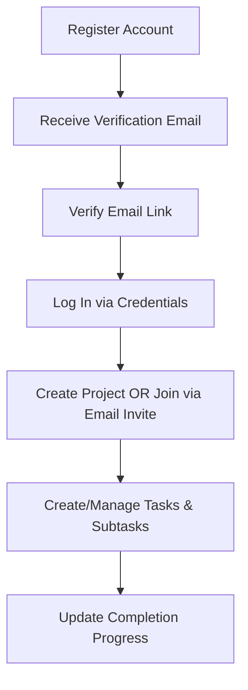

# Technical State Audit: Project Camp Backend

This document evaluates the current architecture, implementation quality, security profile, and product state of the **Project Camp Backend** codebase.

---

## 1. Executive Summary

**Project Camp Backend** is a monolithic RESTful API built on the Express/Mongoose stack designed for multi-tenant project management. The system demonstrates **excellent architectural patterns** (clear layering, strict validation, defense-in-depth sanitization, testing infrastructure, and normalized data schemas) and is currently **mostly feature-complete**.

### Remaining Gaps:

- **Unimplemented Modules:** Task File Attachments are currently placeholders.
- **Local-First Capabilities:** OPFS state sync and offline layers are targeted for future development.
- **Model Context Protocol:** A native MCP server for agent integrations needs to be constructed.

Overall, the codebase represents a **solid, testing-enabled foundation (approximately 85% complete)** ready for advanced feature work.

---

## 2. Product Understanding

### Problem Solved

Managing multi-tenant project collaboration with hierarchical workflows (Projects $\rightarrow$ Tasks $\rightarrow$ Subtasks) and contextual scoping (Notes, Team Roles, Invitations) without suffering from data bloat or data leakage.

### Target Users

1. **System Administrator / Creator:** Initiates projects, manages subscriptions, deletes projects, and oversees global member roles.
2. **Project Admin:** Manages tasks, subtasks, invitations, and content boundaries within assigned projects.
3. **Team Member:** Views tasks, completes subtasks, and contributes to notes.

### User Journey



### Value Proposition

A security-first, highly validated backend that protects project data isolation, prevents data corruption (via input sanitization), and scales gracefully through normalized data schemas.

---

## 3. Feature Inventory

| Feature                      | Purpose                              | Status                          | Dependencies                                | Key Files                                                                                                                                                                                                                                                                                                            |
| :--------------------------- | :----------------------------------- | :------------------------------ | :------------------------------------------ | :------------------------------------------------------------------------------------------------------------------------------------------------------------------------------------------------------------------------------------------------------------------------------------------------------------------- |
| **Authentication & Session** | Dual-token (Access/Refresh JWT) auth | **Implemented**                 | `jsonwebtoken`, `bcryptjs`, `cookie-parser` | [auth.controllers.js](file:///Users/rohan/project-base/src/controllers/auth.controllers.js), [auth.routes.js](file:///Users/rohan/project-base/src/routers/auth.routes.js), [user.model.js](file:///Users/rohan/project-base/src/models/user.model.js)                                                               |
| **Account Security**         | Email verification & password resets | **Implemented**                 | `nodemailer`, `mailgen`, `crypto`           | [mail.js](file:///Users/rohan/project-base/src/utils/mail.js), [auth.controllers.js](file:///Users/rohan/project-base/src/controllers/auth.controllers.js)                                                                                                                                                           |
| **Project CRUD**             | Project lifecycle                    | **Implemented**                 | `mongoose`                                  | [project.controllers.js](file:///Users/rohan/project-base/src/controllers/project.controllers.js), [project.routes.js](file:///Users/rohan/project-base/src/routers/project.routes.js), [project.model.js](file:///Users/rohan/project-base/src/models/project.model.js)                                             |
| **Multi-Tenant RBAC**        | Scopes access roles to projects      | **Implemented**                 | `mongoose`                                  | [permission.middleware.js](file:///Users/rohan/project-base/src/middlewares/permission.middleware.js), [projectMember.model.js](file:///Users/rohan/project-base/src/models/projectMember.model.js)                                                                                                                  |
| **Team Invitations**         | Token-based email invitations        | **Implemented**                 | `nodemailer`, `crypto`                      | [projectInvitation.model.js](file:///Users/rohan/project-base/src/models/projectInvitation.model.js), [projectInvite.controllers.js](file:///Users/rohan/project-base/src/controllers/projectInvite.controllers.js), [projectInvite.routes.js](file:///Users/rohan/project-base/src/routers/projectInvite.routes.js) |
| **Task CRUD**                | Task lifecycle with assignees        | **Implemented**                 | `mongoose`                                  | [task.controllers.js](file:///Users/rohan/project-base/src/controllers/task.controllers.js), [task.routes.js](file:///Users/rohan/project-base/src/routers/task.routes.js)                                                                                                                                           |
| **Subtask Tracking**         | Task breakdown and completion        | **Implemented**                 | `mongoose`                                  | [subtask.model.js](file:///Users/rohan/project-base/src/models/subtask.model.js), [task.controllers.js](file:///Users/rohan/project-base/src/controllers/task.controllers.js#L238-L364)                                                                                                                              |
| **Task Attachments**         | Multiple file uploads per task       | **Placeholder** (Unimplemented) | `multer` (not installed)                    | [task.routes.js](file:///Users/rohan/project-base/src/routers/task.routes.js#L112-L123)                                                                                                                                                                                                                              |
| **Project Notes**            | Personal/Shared notes                | **Implemented**                 | `mongoose`                                  | [note.model.js](file:///Users/rohan/project-base/src/models/note.model.js), [note.controllers.js](file:///Users/rohan/project-base/src/controllers/note.controllers.js), [note.routes.js](file:///Users/rohan/project-base/src/routers/note.routes.js)                                                               |
| **System Health Check**      | Liveness probe endpoint              | **Implemented**                 | None                                        | [healthcheck.controllers.js](file:///Users/rohan/project-base/src/controllers/healthcheck.controllers.js)                                                                                                                                                                                                            |

---

## 4. Architecture Review

### Architecture Flow Diagram

```text
  Client Request
       │
       ▼
┌────────────────────────────────────────────────────────┐
│                   Global Middlewares                   │
│        (CORS, Express JSON/URL, Cookie Parser)         │
└──────────────────────┬─────────────────────────────────┘
                       │
                       ▼
┌────────────────────────────────────────────────────────┐
│                 Sanitization Middleware                │
│       (XSS/SQLi Checks, Size Limits, IP Checking)      │
└──────────────────────┬─────────────────────────────────┘
                       │
                       ▼
┌────────────────────────────────────────────────────────┐
│                 Auth Middleware (verifyJWT)            │
│          (Decodes JWT, attaches user to req)           │
└──────────────────────┬─────────────────────────────────┘
                       │
                       ▼
┌────────────────────────────────────────────────────────┐
│             RBAC (checkProjectPermission)              │
│       (Queries ProjectMember role verification)        │
└──────────────────────┬─────────────────────────────────┘
                       │
                       ▼
┌────────────────────────────────────────────────────────┐
│                Input Schema (Zod)                      │
│     (Type cast, default values, contract checks)       │
└──────────────────────┬─────────────────────────────────┘
                       │
                       ▼
┌────────────────────────────────────────────────────────┐
│                       Controller                       │
│        (Business logic executes, Queries database)     │
└──────────────────────┬─────────────────────────────────┘
                       │
                       ▼
┌────────────────────────────────────────────────────────┐
│           Response Schema Validation (Dev only)        │
│          (Prevents sensitive data leaks)               │
└──────────────────────┬─────────────────────────────────┘
                       │
                       ▼
  Client Response
```

### Architectural Pillars

1. **Stateless API:** Client session tokens stored in secure, `httpOnly` cookies.
2. **Normalized Database:** Schema design splits entity states (Projects, Tasks, Subtasks, Members) into isolated collections to bypass MongoDB's 16MB BSON size limit. Virtual Populate handles linking.
3. **Defense-in-Depth Sanitization:** Incoming bodies are aggressively stripped of HTML tags, control characters, and SQL patterns using recursive key traversal.
4. **Fail-Fast Bootstrapping:** Database initialization blocks the Express socket server. If connection fails, the process crashes, notifying process monitors immediately.

---

## 5. Engineering Audit

### Code Quality

- **Strengths:** Folder hierarchy is highly structured. File structures are consistent. Every file includes detailed, educational JSDoc style notes explaining their architectural roles, connections, patterns, and sample interview questions.
- **Weaknesses:** Serious logical bugs (listed below) and minor code styling choices (e.g. PATCH used where PUT is documented, 201 Created sent for GET operations).

### Security

- **Strengths:** Passwords are salted and hashed via `bcryptjs`. Token-based flows (invitations, email verification, password resets) use SHA-256 hashes of the random token inside the database.
- **Weaknesses:** Cleartext request bodies (which include password inputs) are printed to stdout via the global logging middleware.

### Scalability

- **Strengths:** Normalized mongoose relationships prevent collection bloat. Aggregation pipelines are used for user/project mapping, shifting computational loads from the server to MongoDB.
- **Weaknesses:** No caching layer (e.g., Redis) is present for user records or project lists. No compound indexes exist for critical query paths.

### Developer Experience & Testing

- **Strengths:** Extensive configuration documentation in `README.md` and `ARCHITECTURE.md`. Fully established test suite using Vitest with unit/integration testing flows enabled.
- **Weaknesses:** Currently lacking end-to-end (E2E) UI testing (expected, as this is purely a backend API).

---

## 6. Technical Debt & Future Improvements

### 1. Missing Attachment Support

The `task.routes.js` outlines an endpoint for handling attachments via Multer, but it is purely commented out and unimplemented, restricting the ability to upload or attach files to tasks.

### 2. Multi-Tenant Role Isolation Refinement

While Role-Based Access Control is enforced through `checkProjectPermission` and queries are constrained accurately throughout the system, scaling up might require true Row-Level Security (RLS) enforcement at the database driver level.

### 3. Rate Limiter Constraints

A global rate limiter has been scaffolded inside `app.js` using `express-rate-limit`, but environment-specific tuning and more granular rate limiting (e.g. login brute force protection specifically) is advised.

---

## 7. Missing Foundations

While many critical bugs have been addressed, the following foundations would elevate the system further:

1. **Production Logger:** Introduce a structured logging framework (e.g. Winston or Pino) to enforce environment-scoped logging and further maintain strict data sanitization rules set up previously.
2. **Database Caching:** Add a caching layer (such as Redis) to minimize database lookups for session validation and project configurations.
3. **Database Index Optimization:** Add missing compound indexes on:
   - `Task` collection: `(project, status)` and `(project, assignedTo)`
   - `ProjectMember` collection: `(project, user, role)`

---

## 8. Risk Assessment

| Risk                        | Impact     | Likelihood | Mitigation                                                                                         |
| :-------------------------- | :--------- | :--------- | :------------------------------------------------------------------------------------------------- |
| **Denial of Service (DoS)** | **Medium** | **High**   | Rate-limiting middleware is present, but should have explicit request limits globally tuned.       |
| **Data Integrity Decay**    | **High**   | **Low**    | Hook cascading deletes to prevent orphaned subtasks and notes when deleting parent tasks/projects. |
| **RBAC Escalation**         | **High**   | **Low**    | Ensured route parameter mappings are rigidly tested going forward.                                 |

---

## 9. Project Maturity Scorecard

### Product Maturity: 8 / 10

- **Rationale:** The system supports user registration, project CRUD, notes, invitations, and hierarchical task/subtask tracking. Key future extensions include OPFS-sync capabilities and task attachments.

### Architecture Maturity: 9 / 10

- **Rationale:** The layered layout is clean and compliant with SOLID principles. Multi-tenant partitioning and normalized relationships are highly solid choices. The "Fail-Fast" and "Defense-in-Depth" patterns are executed flawlessly.

### Code Quality: 8 / 10

- **Rationale:** Code files are highly readable, modular, and extensively commented, with tests implemented via Vitest for critical system validations.

### Scalability: 7 / 10

- **Rationale:** Database normalization avoids typical MongoDB document size limit bottlenecks, and aggregations optimize complex queries. Missing caching layers and certain indexes reduce optimal performance ceilings.

### Security: 8 / 10

- **Rationale:** Robust password hashing, defensive sanitization middlewares, and correctly aligned parameter authentication checks fortify the API.

### Production Readiness: 7 / 10

- **Rationale:** Operational and backed by foundational test suites. Lacks specific production structured-logging mechanisms and caching infrastructure for highly-trafficked deployment sizes.
