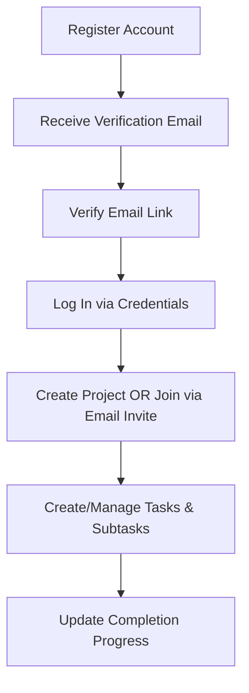

# Technical State Audit: Project Camp Backend

This document evaluates the current architecture, implementation quality, security profile, and product state of the **Project Camp Backend** codebase.

---

## 1. Executive Summary

**Project Camp Backend** is a monolithic RESTful API built on the Express/Mongoose stack designed for multi-tenant project management. While the system demonstrates **excellent architectural patterns** (clear layering, strict validation, defense-in-depth sanitization, and normalized data schemas), it is currently **unstable and unusable in its current state**.

### Critical Gaps:
- **Server Startup Crash:** A Zod import syntax error (`z.email()`) prevents the application from starting.
- **Broken Core Endpoints:** Crucial endpoints (Project Listing, Invitation Resend, and Invitation Cancellation) are blocked by incorrect mapping of route parameters to the RBAC authorization middleware.
- **Security Vulnerability:** Plaintext passwords are logged directly to stdout via a global debug middleware.
- **Unimplemented Modules:** The Notes feature is a skeleton/stub, and Task File Attachments are completely missing.

Overall, the codebase represents a **strong foundation (approximately 50% complete)** but requires remediation of critical path bugs before any new feature work can proceed.

---

## 2. Product Understanding

### Problem Solved
Managing multi-tenant project collaboration with hierarchical workflows (Projects $\rightarrow$ Tasks $\rightarrow$ Subtasks) and contextual scoping (Notes, Team Roles, Invitations) without suffering from data bloat or data leakage.

### Target Users
1. **System Administrator / Creator:** Initiates projects, manages subscriptions, deletes projects, and oversees global member roles.
2. **Project Admin:** Manages tasks, subtasks, invitations, and content boundaries within assigned projects.
3. **Team Member:** Views tasks, completes subtasks, and contributes to notes.

### User Journey


### Value Proposition
A security-first, highly validated backend that protects project data isolation, prevents data corruption (via input sanitization), and scales gracefully through normalized data schemas.

---

## 3. Feature Inventory

| Feature | Purpose | Status | Dependencies | Key Files |
| :--- | :--- | :--- | :--- | :--- |
| **Authentication & Session** | Dual-token (Access/Refresh JWT) auth | **Implemented** | `jsonwebtoken`, `bcryptjs`, `cookie-parser` | [auth.controllers.js](file:///Users/rohan/project-base/src/controllers/auth.controllers.js), [auth.routes.js](file:///Users/rohan/project-base/src/routers/auth.routes.js), [user.model.js](file:///Users/rohan/project-base/src/models/user.model.js) |
| **Account Security** | Email verification & password resets | **Implemented** | `nodemailer`, `mailgen`, `crypto` | [mail.js](file:///Users/rohan/project-base/src/utils/mail.js), [auth.controllers.js](file:///Users/rohan/project-base/src/controllers/auth.controllers.js) |
| **Project CRUD** | Project lifecycle | **Implemented** | `mongoose` | [project.controllers.js](file:///Users/rohan/project-base/src/controllers/project.controllers.js), [project.routes.js](file:///Users/rohan/project-base/src/routers/project.routes.js), [project.model.js](file:///Users/rohan/project-base/src/models/project.model.js) |
| **Multi-Tenant RBAC** | Scopes access roles to projects | **Broken** (Param wiring bug) | `mongoose` | [permission.middleware.js](file:///Users/rohan/project-base/src/middlewares/permission.middleware.js), [projectMember.model.js](file:///Users/rohan/project-base/src/models/projectMember.model.js) |
| **Team Invitations** | Token-based email invitations | **Broken** (Param wiring bug) | `nodemailer`, `crypto` | [projectInvitation.model.js](file:///Users/rohan/project-base/src/models/projectInvitation.model.js), [projectInvite.controllers.js](file:///Users/rohan/project-base/src/controllers/projectInvite.controllers.js), [projectInvite.routes.js](file:///Users/rohan/project-base/src/routers/projectInvite.routes.js) |
| **Task CRUD** | Task lifecycle with assignees | **Implemented** | `mongoose` | [task.controllers.js](file:///Users/rohan/project-base/src/controllers/task.controllers.js), [task.routes.js](file:///Users/rohan/project-base/src/routers/task.routes.js) |
| **Subtask Tracking** | Task breakdown and completion | **Implemented** | `mongoose` | [subtask.model.js](file:///Users/rohan/project-base/src/models/subtask.model.js), [task.controllers.js](file:///Users/rohan/project-base/src/controllers/task.controllers.js#L238-L364) |
| **Task Attachments** | Multiple file uploads per task | **Placeholder** (Unimplemented) | `multer` (not installed) | [task.routes.js](file:///Users/rohan/project-base/src/routers/task.routes.js#L112-L123) |
| **Project Notes** | Personal/Shared notes | **Skeleton** (Unimplemented stubs) | `mongoose` | [note.model.js](file:///Users/rohan/project-base/src/models/note.model.js), [note.controllers.js](file:///Users/rohan/project-base/src/controllers/note.controllers.js), [note.routes.js](file:///Users/rohan/project-base/src/routers/note.routes.js) |
| **System Health Check** | Liveness probe endpoint | **Implemented** | None | [healthcheck.controllers.js](file:///Users/rohan/project-base/src/controllers/healthcheck.controllers.js) |

---

## 4. Architecture Review

### Architecture Flow Diagram
```text
  Client Request
       │
       ▼
┌────────────────────────────────────────────────────────┐
│                   Global Middlewares                   │
│        (CORS, Express JSON/URL, Cookie Parser)         │
└──────────────────────┬─────────────────────────────────┘
                       │
                       ▼
┌────────────────────────────────────────────────────────┐
│                 Sanitization Middleware                │
│       (XSS/SQLi Checks, Size Limits, IP Checking)      │
└──────────────────────┬─────────────────────────────────┘
                       │
                       ▼
┌────────────────────────────────────────────────────────┐
│                 Auth Middleware (verifyJWT)            │
│          (Decodes JWT, attaches user to req)           │
└──────────────────────┬─────────────────────────────────┘
                       │
                       ▼
┌────────────────────────────────────────────────────────┐
│             RBAC (checkProjectPermission)              │
│       (Queries ProjectMember role verification)        │
└──────────────────────┬─────────────────────────────────┘
                       │
                       ▼
┌────────────────────────────────────────────────────────┐
│                Input Schema (Zod)                      │
│     (Type cast, default values, contract checks)       │
└──────────────────────┬─────────────────────────────────┘
                       │
                       ▼
┌────────────────────────────────────────────────────────┐
│                       Controller                       │
│        (Business logic executes, Queries database)     │
└──────────────────────┬─────────────────────────────────┘
                       │
                       ▼
┌────────────────────────────────────────────────────────┐
│           Response Schema Validation (Dev only)        │
│          (Prevents sensitive data leaks)               │
└──────────────────────┬─────────────────────────────────┘
                       │
                       ▼
  Client Response
```

### Architectural Pillars
1. **Stateless API:** Client session tokens stored in secure, `httpOnly` cookies.
2. **Normalized Database:** Schema design splits entity states (Projects, Tasks, Subtasks, Members) into isolated collections to bypass MongoDB's 16MB BSON size limit. Virtual Populate handles linking.
3. **Defense-in-Depth Sanitization:** Incoming bodies are aggressively stripped of HTML tags, control characters, and SQL patterns using recursive key traversal.
4. **Fail-Fast Bootstrapping:** Database initialization blocks the Express socket server. If connection fails, the process crashes, notifying process monitors immediately.

---

## 5. Engineering Audit

### Code Quality
- **Strengths:** Folder hierarchy is highly structured. File structures are consistent. Every file includes detailed, educational JSDoc style notes explaining their architectural roles, connections, patterns, and sample interview questions.
- **Weaknesses:** Serious logical bugs (listed below) and minor code styling choices (e.g. PATCH used where PUT is documented, 201 Created sent for GET operations).

### Security
- **Strengths:** Passwords are salted and hashed via `bcryptjs`. Token-based flows (invitations, email verification, password resets) use SHA-256 hashes of the random token inside the database.
- **Weaknesses:** Cleartext request bodies (which include password inputs) are printed to stdout via the global logging middleware.

### Scalability
- **Strengths:** Normalized mongoose relationships prevent collection bloat. Aggregation pipelines are used for user/project mapping, shifting computational loads from the server to MongoDB.
- **Weaknesses:** No caching layer (e.g., Redis) is present for user records or project lists. No compound indexes exist for critical query paths.

### Developer Experience & Testing
- **Strengths:** Extensive configuration documentation in `README.md` and `ARCHITECTURE.md`.
- **Weaknesses:** Total absence of unit, integration, or contract tests. `npm test` crashes immediately.

---

## 6. Technical Debt & Critical Gaps

### 1. Zod Compilation Syntax Error (Server Crash)
In [response.schemas.js](file:///Users/rohan/project-base/src/validators/response.schemas.js#L16), the validator uses `z.email()`. Zod does not have a top-level `.email()` validator; the correct syntax is `z.string().email()`. Because this schema is loaded at startup when importing routers, the server throws a `TypeError: z.email is not a function` and crashes immediately.

### 2. Parameter Mismatch in Project Listing RBAC
In [project.routes.js](file:///Users/rohan/project-base/src/routers/project.routes.js#L52), the root route `GET /` (which lists all projects the user is in) mounts the `checkProjectPermission` middleware. However, the path does not contain a `:projectId` parameter. The authorization middleware attempts to parse `req.params.projectId` (which is `undefined`) and queries:
```javascript
ProjectMember.findOne({ project: undefined, user: userId })
```
This query returns `null`, throwing a 403 Forbidden error for logged-in users trying to list their projects.

### 3. Parameter Mismatch in Resend/Cancel Invitations
In [projectInvite.routes.js](file:///Users/rohan/project-base/src/routers/projectInvite.routes.js#L63-L76), both the `/resend` and `/cancel` routes apply `checkProjectPermission`. However, the routes use `:invitationId` as a parameter instead of `:projectId`. Since there is no `:projectId` in the parameters, the permission check fails and throws a 403 Forbidden error, blocking admins from performing these actions.

### 4. Cleartext Credentials Leakage in Logs
In [app.js](file:///Users/rohan/project-base/src/app.js#L15-L21), the debug middleware logs the entire request body (`req.body`) for all endpoints. For `/register`, `/login`, `/change-password`, and `/delete-user`, this dumps plaintext user passwords directly into the application logs (stdout/stderr).

### 5. Missing Validation Schemas
The `POST /refresh-access-token` and `POST /delete-user` routes do not have associated Zod input validation schemas mounted, exposing controllers to raw inputs.

### 6. Incomplete Modules (Stubs/commented-out placeholders)
- **Notes Module:** Entirely unimplemented. Controllers are empty function shells, and route handlers are commented out.
- **Task Attachments:** Comments sketch out future attachment uploading, but the `multer` dependency is missing from the project, and the attachment controller/routes are unimplemented.

---

## 7. Missing Foundations

Before adding any additional features, the following software engineering foundations must be established:
1. **Testing Infrastructure:** Configure a test runner (e.g. Jest or Vitest) and write integration tests for Auth, Projects, and Tasks.
2. **Production Logger:** Replace stdout `console` logs with a structured logging framework (e.g. Winston or Pino) to enforce environment-scoped logging and prevent sensitive data leakage.
3. **Database Caching:** Add a caching layer (such as Redis) to minimize database lookups for session validation and project configurations.
4. **Production Rate-Limiter:** Implement `express-rate-limit` to prevent brute-force attacks on the Auth API.
5. **Database Index Optimization:** Add compound indexes on:
   - `Task` collection: `(project, status)` and `(project, assignedTo)`
   - `ProjectMember` collection: `(project, user, role)`

---

## 8. Risk Assessment

| Risk | Impact | Likelihood | Mitigation |
| :--- | :--- | :--- | :--- |
| **Credential Leakage** | **High** | **High** | Disable body logging for authentication routes or remove the debug logger from production/development. |
| **Denial of Service (DoS)** | **Medium** | **High** | Add rate-limiting middleware and request body size constraints globally. |
| **Data Integrity Decay** | **High** | **Low** | Hook cascading deletes to prevent orphaned subtasks and notes when deleting parent tasks/projects. |
| **RBAC Escalation** | **High** | **Medium** | Ensure route parameter formats are strongly typed and validated (e.g. UUID/MongoId) before validation. |

---

## 9. Project Maturity Scorecard

### Product Maturity: 4 / 10
- **Rationale:** The system only supports user registration, basic project CRUD, and task/subtask tracking. Key features (Notes, File Attachments) are missing. Core flows like project lists and invite management are broken by code defects.

### Architecture Maturity: 7 / 10
- **Rationale:** The layered layout is clean and compliant with SOLID principles. Multi-tenant partitioning and normalized relationships are solid architectural choices. The "Fail-Fast" and "Defense-in-Depth" patterns are well-implemented.

### Code Quality: 6 / 10
- **Rationale:** Code files are readable, modular, and extensively commented. The score is pulled down by compile-time validation syntax errors, HTTP method inconsistencies, and status code discrepancies.

### Scalability: 5 / 10
- **Rationale:** Database normalization avoids typical MongoDB document size limit bottlenecks. Aggregations optimize queries. However, there is a total lack of connection pooling adjustments, caching, or query indexes.

### Security: 4 / 10
- **Rationale:** Robust password hashing and token encryption are used, but credential leakage in logs and broken permission middlewares present severe security gaps.

### Production Readiness: 2 / 10
- **Rationale:** The application cannot start in its current configuration. Critical business endpoints return HTTP 403. There is no automated test suite, CI/CD setup, or structured logging.
